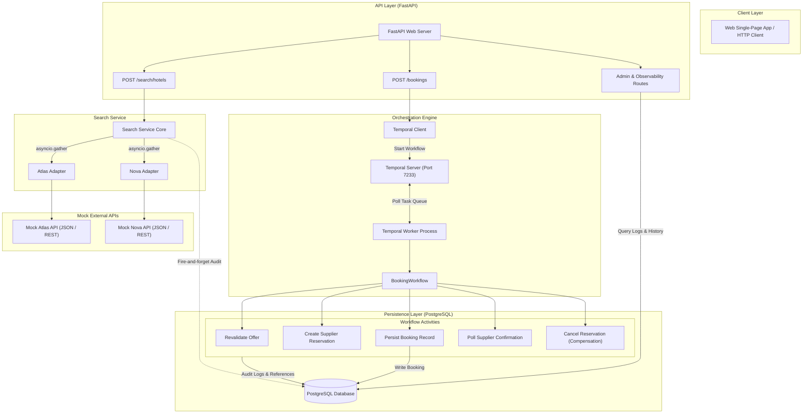

# System Architecture

This document describes the high-level architecture, component interaction, and core design rationale behind the Travel Supplier Search and Booking Engine.

## Architecture Overview

The system is structured as a microservice-ready application separating stateless, high-concurrency search from stateful, durable workflow orchestration. 

---

## Request Flow Walkthroughs

### 1. Hotel Search Flow (Stateless Fan-Out)

When a client submits a search request to `POST /search/hotels`:

1. **Request Validation**: FastAPI validates the incoming payload (`destination`, `check_in`, `check_out`, `guests`, `rooms`) using Pydantic schemas. A unique UUID `request_id` is assigned.
2. **Concurrent Supplier Dispatch**: The search service retrieves registered supplier adapters (`atlas` and `nova`) from the adapter registry and launches searches concurrently using `asyncio.gather(*tasks, return_exceptions=True)`. Each supplier call is wrapped in a strict 5.0-second timeout.
3. **Partial Failure Isolation**: If a supplier adapter times out or raises an exception (e.g. 500 error or malformed payload), the exception is caught, recorded in `suppliers_failed`, and isolated. The overall search query still succeeds as long as at least one supplier responds.
4. **Data Normalization**: Adapters translate vendor-specific responses (such as Atlas's `net_amount` + `tax_and_service` or Nova's `nightlyBase` + `surcharges`) into unified `UnifiedOffer` objects.
5. **Deduplication**: Offers are grouped by `(normalized_property_name, normalized_location)`. If duplicate properties appear across suppliers, we retain the cheaper offer.
6. **Composite Ranking**: The deduplicated offers are scored using a weighted formula (50% price, 30% room availability, 20% supplier confidence) and sorted descending.
7. **Immediate Response & Asynchronous Audit**: The API returns the ranked offers to the client immediately. In the background, a non-blocking asyncio task persists the search metadata, returned offers, and any failure logs into PostgreSQL.

### 2. Booking Flow (Durable Saga Orchestration)

When a client submits a booking request to `POST /bookings`:

1. **Workflow Initiation**: FastAPI receives the booking payload containing an `idempotency_key`. It connects to the Temporal server and starts a `BookingWorkflow` with workflow ID `booking-{idempotency_key}`. If a workflow with that ID already exists, Temporal catches the duplicate start and returns the existing workflow handle without executing duplicate steps.
2. **Revalidation (Step 1)**: The workflow runs `revalidate_offer_activity`, calling the supplier adapter to verify that the room remains available and the price has not drifted. If price drift exceeds 5%, the workflow records the `PRICE_CHANGED` state and terminates gracefully.
3. **Supplier Reservation (Step 2)**: The workflow calls `create_supplier_reservation_activity`, passing the idempotency key to the supplier. On success, the supplier returns a confirmation reference (e.g., `ATL-RES-XXXX`), which is saved to `supplier_references`.
4. **Database Persistence (Step 3)**: The workflow executes `persist_booking_record_activity` to write the `PROCESSING` state to the PostgreSQL `bookings` table.
5. **Supplier Status Polling (Step 4)**: The workflow executes `poll_supplier_confirmation_activity` up to 5 times with a 2-second delay between attempts until the reservation status turns `CONFIRMED`.
6. **Saga Compensation (Rollback)**:
   - If database persistence fails permanently after retries, the Saga triggers `cancel_supplier_reservation_activity` to void the supplier reservation. If cancellation succeeds, the booking transitions to `FAILED`.
   - If the supplier cancellation also fails, the workflow transitions to `REQUIRES_MANUAL_REVIEW`, alerting operators to an inconsistent state that requires human intervention.
   - If an explicit cancellation signal is sent via `POST /bookings/{workflow_id}/cancel` while polling, the workflow halts polling, executes the compensation activity, and transitions to `CANCELLED`.

---

## Why This Architecture

### 1. Adapter Pattern for Supplier Integration
Hotel suppliers use vastly different data formats, date formats (`YYYY-MM-DD` vs `DD-MM-YYYY`), field names (`dest_city` vs `locationName`), and pricing structures. Wrapping each vendor behind a common `SupplierAdapter` interface insulates the core search, ranking, and workflow logic from supplier-specific quirks. Adding a new supplier requires writing one adapter file without touching business logic or database schemas.

### 2. Temporal Engine vs. Hand-Rolled Async Code
Hand-rolled retry loops and background threads fail when worker nodes restart or lose network connectivity. Temporal provides durable execution: workflow state is persisted after every step, allowing execution to resume exactly where it left off even if worker processes crash. Furthermore, Temporal natively handles saga compensation, signals (for out-of-band cancellations), and queries (for real-time frontend status polling) without complex custom database state machines.

### 3. Separation of Search and Booking Concerns
Search is read-heavy, low-latency, and tolerant of partial failures: if one supplier is down, we still want to show results from others. Booking is write-heavy, transactional, and intolerant of ambiguity: a booking must either fully succeed across both supplier and internal systems or roll back completely. Separating search into a stateless service and booking into a Temporal workflow allows each to optimize for its specific failure model and performance requirements.
