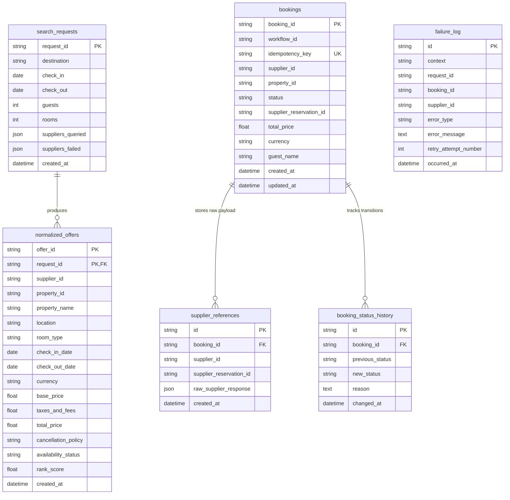

# Database Schema & Data Models

This document details the PostgreSQL database schema, table relationships, primary/foreign key constraints, and key design decisions regarding record persistence.

## Entity Relationship Diagram



---

## Detailed Table Reference

### 1. `bookings`
Stores the canonical state for every booking processed by the system.

| Column | Type | Constraints | Description |
|---|---|---|---|
| `booking_id` | `VARCHAR(64)` | Primary Key, Indexed | Derived identifier formatted as `BK-{idempotency_key[:12]}`. |
| `workflow_id` | `VARCHAR(128)` | Indexed, NOT NULL | Temporal workflow instance ID (`booking-{idempotency_key}`). |
| `idempotency_key` | `VARCHAR(128)` | Unique, Indexed, NOT NULL | Client-supplied key protecting against duplicate submissions. |
| `supplier_id` | `VARCHAR(32)` | NOT NULL | Vendor identifier (e.g. `atlas`, `nova`). |
| `property_id` | `VARCHAR(64)` | NOT NULL | Supplier's property code (e.g. `ATL-PAR-01`). |
| `status` | `VARCHAR(32)` | NOT NULL | Current state (`CONFIRMED`, `FAILED`, `CANCELLED`, `PRICE_CHANGED`, `REQUIRES_MANUAL_REVIEW`). |
| `supplier_reservation_id` | `VARCHAR(128)` | Nullable | Confirmation reference generated by the supplier API. |
| `total_price` | `FLOAT` | NOT NULL | Total charged price including taxes and fees. |
| `currency` | `VARCHAR(10)` | NOT NULL, Default `'USD'` | ISO currency code (e.g. `EUR`, `USD`). |
| `guest_name` | `VARCHAR(128)` | NOT NULL | Full name of the primary guest. |
| `created_at` | `TIMESTAMPTZ` | NOT NULL | Timestamp when the booking was initiated. |
| `updated_at` | `TIMESTAMPTZ` | NOT NULL | Timestamp of the last state modification. |

*Written when*: The Temporal workflow executes `persist_booking_record_activity` during Step 3 and upon completion.

---

### 2. `search_requests`
Stores audit metadata for every search query received by the system.

| Column | Type | Constraints | Description |
|---|---|---|---|
| `request_id` | `VARCHAR(64)` | Primary Key, Indexed | UUID4 identifying the search execution. |
| `destination` | `VARCHAR(128)` | NOT NULL | City or destination query string. |
| `check_in` | `DATE` | NOT NULL | Requested check-in date. |
| `check_out` | `DATE` | NOT NULL | Requested check-out date. |
| `guests` | `INTEGER` | NOT NULL | Number of adult guests. |
| `rooms` | `INTEGER` | NOT NULL | Number of requested rooms. |
| `suppliers_queried` | `JSON` | NOT NULL | JSON array of supplier IDs targeted by the query. |
| `suppliers_failed` | `JSON` | NOT NULL | JSON array of supplier IDs that timed out or erred. |
| `created_at` | `TIMESTAMPTZ` | NOT NULL | Search execution timestamp. |

*Written when*: The search service completes a search and launches a background audit persistence task.

---

### 3. `normalized_offers`
Stores normalized, deduplicated, and ranked offers generated per search request.

| Column | Type | Constraints | Description |
|---|---|---|---|
| `offer_id` | `VARCHAR(64)` | Primary Key, Indexed | Deterministic SHA-256 hash derived from offer parameters. |
| `request_id` | `VARCHAR(64)` | Primary Key, FK -> `search_requests.request_id` | Link to parent search request. |
| `supplier_id` | `VARCHAR(32)` | NOT NULL | Supplier offering the inventory. |
| `property_id` | `VARCHAR(64)` | NOT NULL | Supplier property code. |
| `property_name` | `VARCHAR(128)` | NOT NULL | Display name of the hotel property. |
| `location` | `VARCHAR(128)` | NOT NULL | City or area name. |
| `room_type` | `VARCHAR(64)` | NOT NULL | Room category title. |
| `check_in_date` | `DATE` | NOT NULL | Check-in date for the offer. |
| `check_out_date` | `DATE` | NOT NULL | Check-out date for the offer. |
| `currency` | `VARCHAR(10)` | NOT NULL | Currency code. |
| `base_price` | `FLOAT` | NOT NULL | Net base rate. |
| `taxes_and_fees` | `FLOAT` | NOT NULL | Combined surcharges and taxes. |
| `total_price` | `FLOAT` | NOT NULL | Grand total price (`base_price + taxes_and_fees`). |
| `cancellation_policy` | `VARCHAR(256)` | NOT NULL | Human-readable cancellation terms. |
| `availability_status` | `VARCHAR(32)` | NOT NULL | Room status (`available`, `on_request`). |
| `rank_score` | `FLOAT` | Nullable | Calculated ranking score (normalized 0.0 to 1.0). |
| `created_at` | `TIMESTAMPTZ` | NOT NULL | Insertion timestamp. |

*Written when*: The search service persists audit data after returning the search response to the user.

---

### 4. `supplier_references`
Stores raw, un-truncated response payloads from external suppliers for debugging and auditing.

| Column | Type | Constraints | Description |
|---|---|---|---|
| `id` | `VARCHAR(64)` | Primary Key | Random UUID hex primary key. |
| `booking_id` | `VARCHAR(64)` | FK -> `bookings.booking_id`, Indexed | Foreign key linking to internal booking. |
| `supplier_id` | `VARCHAR(32)` | NOT NULL | Vendor identifier. |
| `supplier_reservation_id` | `VARCHAR(128)` | NOT NULL | Supplier-assigned reservation ID. |
| `raw_supplier_response` | `JSON` | NOT NULL | Complete raw JSON payload returned by the vendor API. |
| `created_at` | `TIMESTAMPTZ` | NOT NULL | Record creation timestamp. |

*Written when*: `record_supplier_reference_activity` executes after successful supplier reservation creation.

---

### 5. `booking_status_history`
Tracks every state transition for a booking to form a complete audit trail.

| Column | Type | Constraints | Description |
|---|---|---|---|
| `id` | `VARCHAR(64)` | Primary Key | Random UUID hex primary key. |
| `booking_id` | `VARCHAR(64)` | FK -> `bookings.booking_id`, Indexed | Foreign key linking to internal booking. |
| `previous_status` | `VARCHAR(32)` | Nullable | Prior status before transition. |
| `new_status` | `VARCHAR(32)` | NOT NULL | Target status after transition. |
| `reason` | `TEXT` | Nullable | Human-readable explanation of why the status changed. |
| `changed_at` | `TIMESTAMPTZ` | NOT NULL | Timestamp of the status change event. |

*Written when*: `record_status_change_activity` is invoked by the Temporal workflow on every state transition.

---

### 6. `failure_log`
Centralized log for tracking runtime exceptions, timeouts, and saga failure events.

| Column | Type | Constraints | Description |
|---|---|---|---|
| `id` | `VARCHAR(64)` | Primary Key | Random UUID hex primary key. |
| `context` | `VARCHAR(64)` | NOT NULL | Subsystem area (`search`, `booking_workflow`, `adapter`). |
| `request_id` | `VARCHAR(64)` | Indexed, Nullable | Associated search request UUID (if applicable). |
| `booking_id` | `VARCHAR(64)` | Indexed, Nullable | Associated booking ID (if applicable). |
| `supplier_id` | `VARCHAR(32)` | Nullable | Supplier involved in the failure. |
| `error_type` | `VARCHAR(128)` | NOT NULL | Exception class or error category. |
| `error_message` | `TEXT` | NOT NULL | Full error details or message. |
| `retry_attempt_number` | `INTEGER` | Nullable | Attempt count at which the failure occurred. |
| `occurred_at` | `TIMESTAMPTZ` | NOT NULL | Timestamp of the failure event. |

*Written when*: A supplier search fails, or when a workflow activity encounters a terminal error.

---

## Deterministic Offer ID Generation

Rather than generating random UUIDs for normalized search offers, we construct deterministic IDs using SHA-256 hashing in `generate_deterministic_offer_id()`:

```python
raw_key = f"{supplier_id.lower()}:{property_id.lower()}:{room_type.lower()}:{str(check_in_date)}:{str(check_out_date)}"
offer_id = f"OFFER-{hashlib.sha256(raw_key.encode('utf-8')).hexdigest()[:16]}"
```

### Rationale
1. **Cross-Search Tracking**: Allows us to detect when the same room offer is returned across multiple independent search requests.
2. **Idempotent Revalidation**: Enables the booking workflow to recreate the exact `offer_id` string from booking parameters when verifying inventory against supplier quotes.
3. **Collision Resistance**: Deriving the hash from the supplier ID, property code, room category, and date range guarantees uniqueness while maintaining determinism.

---

## Migrations & Source of Truth

Database migrations are managed strictly using **Alembic**. The SQLAlchemy models in `db/models.py` define the application entities, while Alembic scripts under `alembic/versions/` govern database DDL changes.

To apply migrations against a running PostgreSQL database:

```bash
alembic upgrade head
```
